# Benchmarks

The benchmarks time decoding, which a service does on every request. They compare ryjwt with:

- [PyJWT](https://github.com/jpadilla/pyjwt), on Python;
- [python-jose](https://github.com/mpdavis/python-jose), [joserfc](https://github.com/authlib/joserfc)
  (Authlib's) and [jwcrypto](https://github.com/latchset/jwcrypto), also on Python;
- [jose](https://github.com/panva/jose) and [fast-jwt](https://github.com/nearform/fast-jwt), on
  Bun (JavaScript);
- [jsonwebtoken](https://github.com/Keats/jsonwebtoken), in Rust.

ryjwt is timed decoding to a dict, to a msgspec `Struct`, and (on the HS256 page) to a pydantic
model.

There are two sets of results:

- [Full matrix](matrix.md): every algorithm and key size, four payload sizes, and four ways of
  getting the key (an HMAC secret, a PEM public key, a JWKS document, and a JWKS URL).
- [HS256 by token and key size](docker.md): HS256 only, with tokens from 231 bytes to 20 KB, and
  secrets from 32 bytes to 4 KB.

## The races

Each bar is one library decoding 100,000 tokens, filling in real time. A library's time is
100,000 times its mean time per decode, from the full matrix.


With HS256, ryjwt decodes around 30 times faster than PyJWT. It's about three times faster than
the fastest JavaScript and Rust libraries.

### Why it's faster than jsonwebtoken (Rust)

Both use the same token, the same checks and the same crypto library (aws-lc), so the gap comes
from the work done per token. jsonwebtoken 11, decoding a typical HS256 token (measured natively
on an M3, in nanoseconds):

| step | jsonwebtoken | ryjwt | why |
| :-- | --: | --: | :-- |
| Read the header | 711 | 3 | jsonwebtoken parses it twice per token; ryjwt remembers headers it has already verified |
| Set up the HMAC key | 116 | 0 | jsonwebtoken re-keys the HMAC per token; ryjwt does it once, when the key is created |
| Compute the HMAC | 340 | 254 | ryjwt reuses the precomputed key state |
| Decode base64 | 151 | 58 | SIMD, into a stack buffer |
| Build the claims | 1,188 | 604 | jsonwebtoken builds a `serde_json::Value`; ryjwt builds the dict in one pass |
| Check the claims | 399 | — | jsonwebtoken deserialises the claims a second time to check them; ryjwt checks them in the same pass |
| Everything else | 249 | 156 | including, for ryjwt, the call from Python |
| **Total** | **3,155** | **1,075** | |

Decoding into a typed Rust struct with the mimalloc allocator, jsonwebtoken's fastest setup, still
takes 2.35 µs: about 2.4 times ryjwt's decode into a msgspec `Struct`.



With ES256, most of the time goes into checking the signature. Every library hands that to a
native crypto library, so the gaps are smaller. ryjwt is about twice as fast as PyJWT, and a
little faster than the others. The race uses ES256 because the [Apple Silicon](#apple-silicon)
slowdown doesn't affect it, so it's fair to every library.

## How they're measured

- Each decode checks the signature, and the `exp` and `aud` claims, as a real service would.
- Before timing, each library's result is checked against the token's claims.
- Each library runs in its own Docker container, limited to one CPU core (pinned) and 500 MB of
  memory. The containers run one after another, so they never compete.
- The JWKS URL cases fetch the keys over HTTPS from a server in another container. They're timed
  once the keys are cached.
- Times are the mean microseconds per decode: lower is better. Each row also shows the speed-up
  over PyJWT.

Each results page says when it was made, and with which versions.

## Apple Silicon

The published results come from Docker on an Apple Silicon Mac. There, aws-lc, the crypto library
under ryjwt and jsonwebtoken, runs RSA, Ed25519, P-384 and P-521 checks slower than it does
natively. Linux on x86_64 or AWS Graviton isn't affected, and neither are HS256 and ES256. The
[full matrix](matrix.md#apple-silicon-caveat) has the details, and native numbers for comparison.

## Running them

The benchmarks are in the repository's `bench/` directory. You need Docker,
[uv](https://docs.astral.sh/uv/) and [Task](https://taskfile.dev):

```console
task bench-docker  # HS256: bench/results-docker.md
task bench-matrix  # the full matrix: bench/results-matrix.md
task race-svg      # the races, from the full matrix's results
```

These pages show those files as they are, so rerunning the benchmarks updates the docs.
