# Benchmarks

The benchmarks time decoding, which a service does on every request. They compare ryjwt with:

- [PyJWT](https://github.com/jpadilla/pyjwt) and [joserfc](https://github.com/authlib/joserfc)
  (Authlib's), on Python;
- [jose](https://github.com/panva/jose) and [fast-jwt](https://github.com/nearform/fast-jwt), on
  Bun (JavaScript);
- [jsonwebtoken](https://github.com/Keats/jsonwebtoken), in Rust, decoding into a typed struct and
  into a `serde_json::Value`.

ryjwt is timed decoding into a msgspec `Struct`, a pydantic `BaseModel`, and a dict, built by
msgspec (when it's installed) and by jiter (when it isn't). The results:

- [The races](races.md): the two cases below, 100,000 decodes in 3 rounds.
- [Full matrix](matrix.md): every algorithm and key size, four payload sizes, and four key sources
  (HMAC secret, PEM public key, JWKS document, JWKS URL).
- [HS256 by token and key size](docker.md): tokens from 231 bytes to 20 KB, secrets from 32 bytes
  to 4 KB.

## The races

Each bar is one library decoding the same token 100,000 times, three times over, filling in at
the mean speed. [The races page](races.md) has each library's time and its range over the three
rounds.


With HS256, ryjwt decodes a typical token over 28 times faster than PyJWT 2.15 into a `Struct`
(27 times into a dict, 23 times with jiter). Against jsonwebtoken (Rust), it's about 1.8 times
faster struct to struct, and 1.8 to 2.2 times faster dict to `Value`. It's about 3.3 times faster
than fast-jwt (Bun). Into a pydantic model it's slower than jsonwebtoken's struct, but still about
13 times faster than PyJWT.

### Why it's faster than jsonwebtoken (Rust)

Both use the same token, checks and crypto library (aws-lc), so the gap is the work per token.
For each token, jsonwebtoken 11 parses the header twice, sets up the HMAC key again, and
deserialises the claims twice: for the result, and to check them. ryjwt sets up the HMAC key once,
when the key is created, skips headers it has already verified, and checks the claims while
building the result.

### RS256



Most identity providers sign with RS256 by default. Most of the time goes on checking the
signature, which every library hands to native crypto, so the gaps are smaller. On this Arm CPU,
fast-jwt wins, taking about 30% less time than ryjwt. ryjwt comes next, about 1.7 times faster
than PyJWT and a little ahead of joserfc and jsonwebtoken, by about 7% and 9%. On x86_64, aws-lc checks RSA signatures
in half the time, and ryjwt finishes first, about 15% ahead of jsonwebtoken and fast-jwt
([cross-check](x86_64.md)).

With ES256, ryjwt is about 2.3 times faster than PyJWT, and a little ahead of jsonwebtoken and
fast-jwt, by about 4% and 11% ([full matrix](matrix.md#pem-public-key)).

## How they're measured

- Each decode checks the signature, `exp` and `aud`, as a real service would.
- Before timing, each library's result is checked against the token's claims, and each is shown
  to reject an expired token and one for another audience.
- The published numbers come from one run of the [Benchmarks workflow](#running-them) on GitHub's
  arm64 Linux runner, a Neoverse-N2. GitHub's x86_64 runners get different CPUs from run to run,
  so they're used for a [cross-check](x86_64.md) instead. Either way it's a shared virtual
  machine, so expect a few percent of variation between runs.
- Each library runs in its own Docker container, with one CPU (pinned to one of Docker's virtual
  CPUs) and 500 MB of memory. The containers run one after another, so they never compete.
- jose and fast-jwt run on [Bun](https://bun.sh), whose crypto is BoringSSL. On Node (OpenSSL),
  their numbers could differ.
- JWKS URL cases fetch the keys over HTTPS from another container, and are timed once the keys are
  cached.
- Each case starts with 1,000 untimed decodes. The races then time 100,000 decodes, three times
  over; the tables time 10,000, once. Times are microseconds per decode (lower is better), the
  mean over every timed decode, with the speed-up over PyJWT.

When reading them, note:

- **The same token, every time.** Each case decodes one token repeatedly, so ryjwt's
  [header cache](../index.md#why-its-fast) always hits, as it does for tokens from one issuer,
  which share a header. The signature and claims are still checked on every decode.
- **ryjwt → dict is timed both ways.** With msgspec installed, ryjwt builds dicts with it;
  without (`uv add ryjwt`), with jiter, which is slower. The jiter lane hides msgspec, and checks
  it really is jiter that's parsing.
- **The speed-ups are against PyJWT 2.15.** Much of PyJWT's time goes on its own Python code, such
  as checking each base64 character, so another version would give different speed-ups.

Each results page says when it was made, and with which versions.

## Apple Silicon

In Docker on an Apple Silicon Mac, aws-lc (the crypto library under ryjwt and jsonwebtoken) runs
RSA, Ed25519, P-384 and P-521 checks about 1.6 to 1.8 times slower than natively, as it doesn't
recognise the CPU. HS256 and ES256 aren't affected. Neither is Linux on x86_64, or on Neoverse Arm
servers such as GitHub's arm64 runner (where the published numbers come from) and AWS Graviton. Results made on a
Mac carry a note saying so.

## Running them

The benchmarks are in the repository's `bench/` directory. You need Docker,
[uv](https://docs.astral.sh/uv/) and [Task](https://taskfile.dev):

```console
task bench-docker  # HS256: bench/results-docker.md
task bench-matrix  # the full matrix: bench/results-matrix.md
task bench-race    # the races: bench/results-race.md, then redraws them
task race-svg      # redraws the races from bench-race's results
```

These pages show those files as is, so rerunning the benchmarks updates the docs.

To run them on Linux, for any commit or tag, run the **Benchmarks** workflow from the repository's
Actions tab, choosing the ref, benchmarks (`race` for just the races) and runner (x86_64 or
arm64). It uploads the results, with a note of the machine, as an artifact;
`task bench-download -- <run id>` puts them in place. To update the published numbers, run `all`
on arm64, so the races and the tables come from the same machine; for the cross-check, run `all`
on x86_64 and fetch it with `task bench-download CROSS_CHECK=x86_64 -- <run id>`. GitHub's Linux runners don't have the
[Apple Silicon](#apple-silicon) slowdown.
