<p align="center">
  
  
</p>

# ryjwt

Fast, strictly typed JSON Web Tokens for Python, written in Rust.

It signs and verifies JWTs with HMAC, RSA, RSA-PSS, ECDSA and EdDSA keys, checks `exp`, `nbf`,
`aud` and `iss`, and decodes the claims into a dict, [msgspec](https://jcristharif.com/msgspec/)
`Struct` or [pydantic](https://docs.pydantic.dev/) `BaseModel`. It also fetches, caches and
refreshes keys from JWKS URLs.

## Install

```console
uv add ryjwt
```

Python 3.12 to 3.14, including free-threaded 3.14t ([threads](threads.md)). No runtime
dependencies. Wheels for Linux (glibc and musl, x86_64 and aarch64), macOS (x86_64 and arm64) and
Windows (x64).

Extras: `ryjwt[msgspec]` speeds up dict decoding and adds `Struct`s; `ryjwt[pydantic]` installs
pydantic, for models.

## A first token

Pick a tab; the rest of the site follows it. **Copy for uv** copies a command that runs the
example, extra and all, with nothing installed first.

=== "msgspec"

    ```python {data-uv-extra="msgspec"}
    import secrets
    from datetime import UTC, datetime, timedelta

    import msgspec
    import ryjwt


    class Claims(msgspec.Struct):
        sub: str
        aud: str
        exp: datetime


    key = ryjwt.SecretKey(secrets.token_bytes(32), algorithms=["HS256"], audience="my-api")

    exp = datetime.now(UTC) + timedelta(minutes=15)
    token = key.encode(Claims(sub="user-1", aud="my-api", exp=exp))
    claims = key.decode(token, type=Claims)  # a Claims: signature, exp and aud checked
    ```

=== "pydantic"

    ```python {data-uv-extra="pydantic"}
    import secrets
    from datetime import UTC, datetime, timedelta

    import pydantic
    import ryjwt


    class Claims(pydantic.BaseModel):
        sub: str
        aud: str
        exp: datetime


    key = ryjwt.SecretKey(secrets.token_bytes(32), algorithms=["HS256"], audience="my-api")

    exp = datetime.now(UTC) + timedelta(minutes=15)
    token = key.encode(Claims(sub="user-1", aud="my-api", exp=exp))
    claims = key.decode(token, type=Claims)  # a Claims: signature, exp and aud checked
    ```

=== "dict"

    ```python {data-uv-extra=""}
    import secrets
    import time

    import ryjwt

    key = ryjwt.SecretKey(secrets.token_bytes(32), algorithms=["HS256"], audience="my-api")

    token = key.encode({"sub": "user-1", "aud": "my-api", "exp": int(time.time()) + 900})
    claims = key.decode(token)  # a dict: signature, exp and aud checked
    ```

[Getting started](getting-started.md) goes on from there.

## Why it's fast



One bar per library, decoding 100,000 HS256 tokens in real time
([benchmarks](benchmarks/index.md)).

- **The work happens in Rust:** splitting and decoding the token, and checking the signature with
  [aws-lc-rs](https://github.com/aws/aws-lc-rs).
- **Keys are prepared once**, when you create the key object.
- **Repeat headers are free.** Tokens from one issuer share a header. Once one verifies, ryjwt
  remembers which key it picks and skips parsing it. The signature and claims are still checked
  every time.
- **Typed claims skip the dict.** With `type=`, your class is built straight from the payload.
  Dicts are built by msgspec if installed, otherwise by the built-in
  [jiter](https://github.com/pydantic/jiter).

With RSA, ECDSA and EdDSA, most of the time goes on the signature check, so the gaps are smaller.
For ES256, ryjwt is about twice as fast as PyJWT, and about as fast as the Rust and Bun libraries.
For RS256, the Bun libraries are faster in the [published numbers](benchmarks/index.md#rs256).
